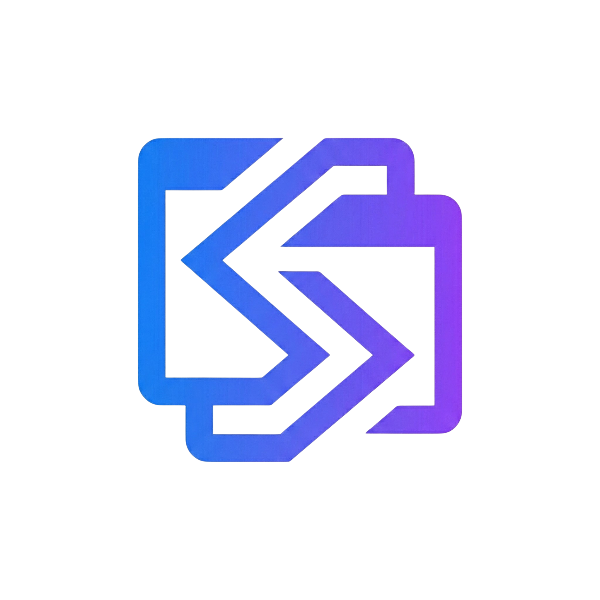
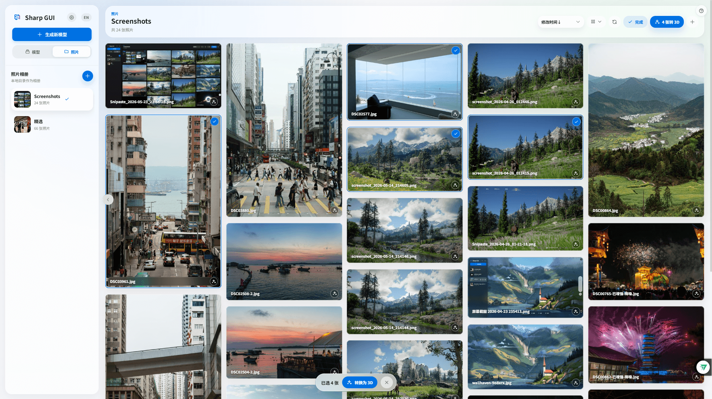
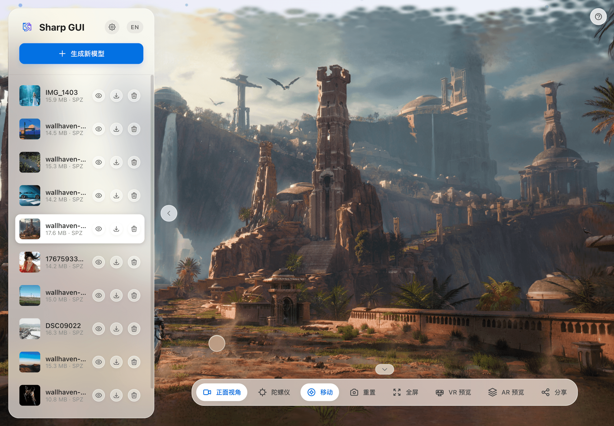

# Sharp GUI

<p align="right">
  <a href="README.md">🇨🇳 中文</a> | <a href="README.en.md">🇺🇸 English</a>
</p>

<div align="center">

**A Beautiful 3D Gaussian Splatting GUI**



<br>

**💡 Background**

Homepage: https://lueluelue12138.github.io/sharp-gui/

The "Spatial Photos" feature in iOS 26 offers an amazing immersive experience, but is currently limited to the Apple ecosystem.

As a Web enthusiast, I built Sharp GUI to bridge this gap. My goal is to let anyone—whether on Android, Windows, Mac or VR device—**[deploy with one click](#-quick-start)** and create and share 3D spatial memories directly via a browser on their local network. This is a hobbyist exploration, built for everyone to enjoy.

<br>


Built on [Apple ml-sharp](https://github.com/apple/ml-sharp). No cloud uploads needed. **Host Locally, Access Everywhere.** Beyond generating and viewing 3D models, Sharp GUI can also browse local, external-drive, or NAS photo folders as a lightweight LAN photo gallery.

[Features](#-features) •
[Preview](#-preview) •
[Quick Start](#-quick-start) •
[Usage](#-usage) •
[LAN Access Gate](#-lan-access-gate-and-privacy-boundary) •
[Architecture](#%EF%B8%8F-architecture)

</div>

> [!WARNING]
> **No content restrictions for local deployment** - Users are fully responsible for generated content. Please comply with local laws and regulations. See [Disclaimer](#-disclaimer).

---

## 📑 Table of Contents

<table align="center">
<tr>
<td width="190" align="center" valign="top">

### 🚀

**Getting Started**

<sub>Up and running in minutes</sub>

<br>

[Recent Highlights](#-recent-highlights)<br>
[Quick Start](#-quick-start)<br>
[Usage Guide](#-usage)

</td>
<td width="190" align="center" valign="top">

### ✨

**Features & Design**

<sub>What Sharp GUI can do</sub>

<br>

[Feature Highlights](#-features)<br>
[Interface Preview](#-preview)

</td>
<td width="190" align="center" valign="top">

### ⚙️

**Config & Security**

<sub>Customize and lock down</sub>

<br>

[Configuration](#%EF%B8%8F-configuration)<br>
[LAN Access Gate](#-lan-access-gate-and-privacy-boundary)

</td>
<td width="190" align="center" valign="top">

### 🛠️

**Build & Community**

<sub>Hack, ship, and contribute</sub>

<br>

[Architecture](#%EF%B8%8F-architecture)<br>
[Developer Guide](#%EF%B8%8F-developer-guide)<br>
[Release History](#-release-history)<br>
[Contributing](#-contributing) · [Credits](#-acknowledgements)

</td>
</tr>
</table>

<div align="center"><sub>📄 <a href="#-license">License</a> &nbsp;·&nbsp; ⚠️ <a href="#-disclaimer">Disclaimer</a></sub></div>

---

## 🆕 Recent Highlights

<details open>
<summary><b>Click to collapse — user-facing highlights</b></summary>

<br>

**🗂️ Local Media Gallery** — Configure local, external-drive, or NAS folders as albums. Browse, filter, preview, and download photos and videos together; photos can be converted to 3D one by one or in batches, while videos can be played, scrubbed, and viewed fullscreen.

**📥 Upload Into Current Album** — Add photos directly to the current album with file picker or drag-and-drop; the album refreshes automatically after upload.

**⚡ Faster Gallery Startup** — Gallery indexing now loads on demand, so startup no longer waits for a full album scan and large libraries show the first screen faster.

**🔐 Safer LAN Access** — Optional access-code gate, real LAN bind toggle, sensitive-file protection, and debug mode off by default make long-running home LAN use safer.

**📦 Windows Full Portable Bundles** — Two flavours, `cu128-rtx50` and `cu126-mainstream`, ship Python + PyTorch + model cache out of the box (downloaded from the cloud-drive link in the Release notes, with matching `.sha256.txt`).

Full release notes → **[Latest Release](https://github.com/lueluelue12138/sharp-gui/releases/latest)**

</details>

---

## ✨ Features

### 🏠 Host Once, Access Anywhere

No need to install apps on every device. Run Sharp GUI on one computer, and any phone, tablet or VR device on your LAN can access it instantly via browser. Full HTTPS support ensures features like gyroscope work perfectly on all devices.

### 🚀 Core Features

| Feature                    | Description                                                                                                                                                              |
| -------------------------- | ------------------------------------------------------------------------------------------------------------------------------------------------------------------------ |
| **📸 Image to 3D**         | Upload any image; Apple ML-Sharp generates a 3D Gaussian Splatting model. The ~500MB model is pre-downloaded during install.                                             |
| **🖼️ Modern Workflow**     | Multi-select / drag-and-drop upload, virtualized gallery, in-app original viewer, smart task queue (2s while active, 10s idle), slide-out delete, cancellable jobs.      |
| **🗂️ Local Media Gallery** | Configure multiple local/NAS folders as albums, browse and filter photos/videos together, preview and download media, convert photos to 3D, and play videos directly. |
| **👁️ Real-time Viewer**    | Three.js + Spark 2.0 WASM-accelerated viewer with mouse / touch / keyboard (WASD) / gyroscope controls, click-to-focus with a GPU focus ring, quick transform panel.     |
| **🎭 Reveal Effects**      | Magic / Spread / Unroll / Twister / Rain entrance animations with replay support.                                                                                        |
| **📱 Mobile Optimized**    | Phones / tablets get gyroscope controls (iOS-style indicator ball), virtual joystick, touch gestures, and a drawer-style sidebar.                                        |
| **🥽 VR/AR Preview**       | WebXR VR mode + AR Passthrough on Quest 3/Pro and similar headsets, with controller / touch input.                                                                       |
| **📤 One-Click Share**     | Export a standalone HTML file powered by Spark 2.0; the compact SPZ payload is embedded by default, double-click to open anywhere.                                       |
| **🎮 GPU Acceleration**    | Auto-detects NVIDIA GPUs and matches a CUDA-enabled PyTorch (cu118 / cu126 / cu128) for noticeably faster inference.                                                     |
| **🔄 Auto-Update**         | One-click update to the latest release with a pre-release channel; preserves `inputs/` `outputs/` `config.json` and other user data.                                     |
| **🔐 Security & Privacy**  | Fully local data, one-click self-signed SSL, optional LAN access gate (HttpOnly cookie + access code + brute-force backoff).                                             |
| **🚀 One-Click Deploy**    | Auto-configures Python / Git, installs deps, pre-downloads models, generates HTTPS certs, and shows skeleton progress. Ready out of the box.                             |

### 🎨 Apple-Style UI Design

Built with Apple Human Interface Guidelines for a premium feel:

| Element                  | Description                                                                                              |
| ------------------------ | -------------------------------------------------------------------------------------------------------- |
| **🪟 Glass Morphism**    | Global `backdrop-filter: blur(30px)` with translucent panels across control bar, toolbar, and modals     |
| **🔤 SF Pro Fonts**      | Apple system font stack for native rendering                                                             |
| **✨ Particle Background** | Canvas floating particles with a soft default fade-in, no harsh first-frame                            |
| **🎬 Smooth Animations** | All interactions tuned with `cubic-bezier` easing; respects `prefers-reduced-motion`                     |
| **🌗 Dark Mode**         | Adaptive system dark mode support                                                                        |
| **🎯 Polished Details**  | Collapsible bottom controls, forward-only progress bar, gradient skeleton loading, slide-out delete, multi-select floating action bar |

### 🔧 Advanced Features

- **🔒 HTTPS Support** - Auto-generated self-signed certificates for safer LAN access (browsers require secure context for sensor APIs)
- **📦 File Optimization** - Auto-generates compact SPZ models, usually **5-10x smaller** than PLY while preserving the original PLY
- **🧹 Auto Cleanup** - Completed tasks auto-removed from memory after 1 hour to prevent leaks
- **⚙️ Configurable Paths** - Custom workspace folder, supports Windows / Linux / macOS
- **🖥️ Fullscreen Mode** - Immersive 3D preview
- **🥽 WebXR** - VR preview + AR Passthrough on Quest 3/Pro and similar headsets
- **🎯 Click-to-Focus** - WASM-accelerated raycasting + GPU focus ring animation
- **🌐 i18n** - Chinese/English bilingual UI, auto-detects browser language, manual toggle

---

## 📷 Preview

### Main Interface

<p align="center">
  
</p>

<p align="center"><i>Sidebar gallery + 3D model preview + glassmorphism control bar</i></p>

### Local Media Gallery

<p align="center">
  
</p>

<p align="center"><i>Multi-folder albums, mixed photo/video browsing, media preview, multi-select to 3D</i></p>

### Mobile Adaptation

<p align="center">
  &nbsp;&nbsp;&nbsp;&nbsp;
  
</p>

<p align="center">
  <i>Left: Mobile drawer sidebar | Right: Tablet split layout</i>
</p>

### 🎬 Camera Movement Controls

<p align="center">
  &nbsp;&nbsp;&nbsp;&nbsp;
  
</p>

<p align="center">
  <i>Left: WASD/QE keyboard movement (Shift for precision) | Right: Mobile virtual joystick</i>
</p>

### 🎬 Batch Upload + Queue Processing

<p align="center">
  
</p>

<p align="center"><i>Drag multiple images to sidebar, queue updates in real-time</i></p>

### 🎬 Gyroscope Control (Mobile)

<p align="center">
  
</p>

<p align="center"><i>Tilt phone to control view, iOS-style real-time indicator ball</i></p>

### 🎬 One-Click Export & Share

<p align="center">
  
</p>

<p align="center"><i>Click Share to export standalone HTML, double-click to open in any browser</i></p>

---

## 🚀 Quick Start

### System Requirements

| Platform                    | Inference Backend | Status        |
| --------------------------- | ----------------- | ------------- |
| **macOS Apple Silicon**     | ✅ MPS            | ✅ Verified   |
| **Windows x86_64**          | ✅ CPU            | ✅ Verified   |
| **Windows x86_64 + NVIDIA** | ✅ CUDA           | ✅ Verified   |
| **Linux x86_64**            | ✅ CPU            | ✅ Verified   |
| **Linux x86_64 + NVIDIA**   | ✅ CUDA           | ❓ Unverified |
| **macOS Intel**             | ✅ CPU            | ❓ Unverified |

> 🚀 **NVIDIA GPU recommended**: 3D Gaussian Splatting inference is compute-heavy. CUDA typically delivers **multiple-x to ~10x** speedups over pure CPU, with a noticeably better experience.
>
> 💡 **CPU-only still works**: inference runs fine without a GPU, just slower per image. Apple Silicon users get a near-GPU experience via the MPS backend.
>
> 🛠️ **Zero manual setup**: when an NVIDIA GPU is present, the install script detects your driver and installs the matching CUDA-enabled PyTorch (cu118 / cu126 / cu128).
>
> 👉 Unverified platforms should theoretically work. Report issues on [GitHub Issues](https://github.com/lueluelue12138/sharp-gui/issues).

### Option 1: Download Pre-built Package (Recommended for Users)

Download the latest version from [Releases](https://github.com/lueluelue12138/sharp-gui/releases):

```bash
# 1. Download and extract
unzip sharp-gui-vX.Y.Z.zip
cd sharp-gui

# 2. Run install script (auto-configures Python env, downloads model, generates certs)
./install.sh      # Linux/macOS
# or
install.bat       # Windows

# 3. Start server
./run.sh          # Linux/macOS
# or
run.bat           # Windows
```

> 💡 Pre-built packages include compiled frontend, **no Node.js required**. Ready to use out of the box.
>
> 💡 Want latest features? Download [Pre-release](https://github.com/lueluelue12138/sharp-gui/releases) versions (marked as `Pre-release`).
>
> 💡 Windows RTX 50 / mainstream NVIDIA GPU users can grab the **full portable bundles** (`cu128-rtx50` or `cu126-mainstream`) from the cloud-drive link in the Release body. They include Python, PyTorch, and the model cache out of the box, with matching `.sha256.txt` for verification.

### Option 2: Install from Source (Developers / Latest Features)

```bash
# 1. Clone project
git clone https://github.com/lueluelue12138/sharp-gui.git
cd sharp-gui

# 2. Run install script (auto-clones ml-sharp and configures environment)
./install.sh      # Linux/macOS
# or
install.bat       # Windows

# 3. (Optional) To modify frontend, install Node.js 18+ then run:
./build.sh        # Build frontend
```

> 💡 The install script auto-generates HTTPS certificates. HTTPS mode is recommended for full functionality.

### What Does the Install Script Do?

The install script automatically handles all setup steps, no manual configuration needed:

- 🐍 **Detect/Install Python** - Auto-finds compatible version (3.10~3.13), auto-installs if missing (Windows)
- 📦 **Detect/Install Git** - Auto-installs if missing (Windows)
- 🎮 **Detect NVIDIA GPU** - Auto-installs the CUDA-enabled PyTorch that matches your driver (cu118 / cu126 / cu128)
- 🧩 **Install Dependencies** - Creates virtual environment, installs ml-sharp core and GUI deps
- 📥 **Pre-download Model** - Downloads inference model (~500MB) during install, no wait on first run
- 🔐 **Generate HTTPS Certificate** - Auto-generates self-signed certificate for secure LAN access

### Start Server

```bash
./run.sh          # Linux/macOS (React version)
./run.sh --legacy # Use original single-file version
# or
run.bat           # Windows
```

Access **https://127.0.0.1:5050 (recommended)** or **http://127.0.0.1:5050** 🎉

> 🩺 When reporting an issue, run in verbose mode: `./run_verbose.sh` / `run_verbose.bat`. It captures runtime info, command paths, PATH, and full exception traces into `sharp-gui-verbose.log`.

### Update

```bash
# Update to latest stable release
./update.sh       # Linux/macOS
update.bat        # Windows

# Update to latest version (including pre-releases)
./update.sh --pre
```

> 💡 The update script auto-detects the latest Release and downloads it, preserving your models and output files.

### Uninstall

All dependencies are installed inside the project's `venv/` virtual environment and won't affect your system. To uninstall, simply delete the project folder:

```bash
# Delete project (includes venv, ml-sharp, models, etc.)
rm -rf sharp-gui/

# (Optional) Clean model cache
# Windows: del %USERPROFILE%\.cache\torch\hub\checkpoints\sharp_*.pt
# macOS/Linux: rm ~/.cache/torch/hub/checkpoints/sharp_*.pt
```

---

## 📖 Usage

### Generate 3D Models

1. **Upload Image** - Click "Generate New" or drag images to sidebar
2. **Wait for Processing** - Watch queue progress (first run downloads ~500MB model)
3. **Preview Model** - Click gallery items to view 3D

### Browse Local Media Albums

1. **Switch to Gallery** - Use the sidebar `Models / Photos` entry to open the local media gallery
2. **Add Folder** - From localhost, add Windows / Linux / macOS paths; each folder is shown as an album
3. **Browse Media** - Photos use cached thumbnails and open originals on demand; videos can be previewed, scrubbed, viewed fullscreen, and downloaded
4. **Upload to Album** - Pick or drag photos into the current album; the album refreshes automatically
5. **Convert to 3D** - Convert photos from cards or the preview layer, or multi-select and queue a batch into the existing workflow

### 3D Interaction Controls

#### Basic Operations

| Action      | Desktop          | Mobile              |
| ----------- | ---------------- | ------------------- |
| Rotate View | Left-click drag  | Single finger swipe |
| Pan         | Right-click drag | Two finger pan      |
| Zoom        | Scroll wheel     | Pinch               |
| Fine Zoom   | Shift + Scroll   | -                   |
| Lock Focus  | Click on model   | Tap on model        |

#### Camera Movement

| Control              | Description                                           |
| -------------------- | ----------------------------------------------------- |
| **WASD / QE**        | Keyboard camera pan (forward/back/left/right/up/down) |
| **Shift + WASD**     | Fast movement mode                                    |
| **Alt + WASD**       | Precision movement mode                               |
| **Virtual Joystick** | Mobile touch pan (tap Move button to enable)          |

#### Special Modes

| Mode           | Action                          | Description                                                                |
| -------------- | ------------------------------- | -------------------------------------------------------------------------- |
| Quick Controls | Tap the gear button             | Adjust model scale, position, rotation, interaction direction, and quality |
| Reveal Effects | Use the right-side effects rail | Switch or replay Magic / Spread / Unroll / Twister / Rain                  |
| Gyroscope      | Tap "Gyro" button               | Tilt phone to control view                                                 |
| Front View     | Tap "Front View" button         | Lock to front view, tap again free                                         |
| Reset          | Tap "Reset" button              | Restore initial view                                                       |
| Fullscreen     | Tap "Fullscreen" button         | Immersive preview                                                          |
| VR Preview     | Tap "VR" button                 | Enter VR mode (requires VR device)                                         |
| AR Preview     | Tap "AR" button                 | AR Passthrough overlay 3D model                                            |
| Reset          | Press "R" key                   | Quick reset camera to initial view                                         |

### Export & Share

Click **Share** button to generate a standalone HTML file:

- 📦 Complete 3D viewer included (Three.js + Spark 2.0)
- 🌐 No server needed, double-click to open in browser
- 📉 Embeds compact SPZ by default; the legacy PLY/Splat export path remains available for compatibility
- 🔒 Includes disclaimer about content responsibility

---

## ⚙️ Configuration

### Custom Workspace

Configure via UI settings or edit `config.json` (generated on first run):

```json
{
  "workspace_folder": "/path/to/workspace",
  "photo_gallery_roots": [
    {
      "id": "my-album",
      "name": "Photos",
      "path": "/path/to/photos",
      "recursive": true,
      "enabled": true
    }
  ]
}
```

The system auto-creates:

- `inputs/` - Uploaded images
- `outputs/` - Generated models
- `.photo-gallery-cache/` - Local photo gallery index and cached thumbnails

> 💡 `photo_gallery_roots` can be added from the UI. When editing manually, use paths from the server machine. Windows, Linux, and macOS are supported; LAN clients browse folders on the host running Sharp GUI.

### Enable HTTPS (Recommended)

HTTPS enables **gyroscope on LAN devices** (browsers require secure context for sensor APIs).

The install script auto-generates certificates. For manual generation:

```bash
python tools/generate_cert.py
```

> 💡 **Windows Users**: Install [Git for Windows](https://git-scm.com/download/win) or OpenSSL first.

After generating, restart and access via `https://`:

| Mode      | Local                  | LAN               | Gyroscope     |
| --------- | ---------------------- | ----------------- | ------------- |
| **HTTPS** | https://127.0.0.1:5050 | https://[IP]:5050 | ✅ Available  |
| HTTP      | http://127.0.0.1:5050  | http://[IP]:5050  | ❌ Local only |

First HTTPS access shows certificate warning (self-signed), click "Continue" to proceed.

---

## 🔐 LAN Access Gate and Privacy Boundary

Sharp GUI ships an **optional** LAN access gate. On first startup—or whenever the local owner has not finished configuring it—the app shows a gentle reminder to set an access code; you can configure it later or stop showing the reminder. The gate is off by default; existing `config.json` files keep working unchanged.

### Permission Matrix

The table below shows the permission boundaries for each role:

| Action                                   | Public (locked remote) | Unlocked Remote (with access code) | Local Owner (localhost) |
| ---------------------------------------- | :--------------------: | :--------------------------------: | :---------------------: |
| Browse models / photos / thumbnails      | ❌ (when gate is on)   |                 ✅                 |           ✅            |
| Download originals / model files / HTML  | ❌ (when gate is on)   |                 ✅                 |           ✅            |
| Submit generation / photo-to-3D jobs     |          ❌            |  Only when "Remote Generation" is on |          ✅            |
| Modify settings / delete model / restart |          ❌            |                 ❌                 |           ✅            |
| Manage album folders / cancel tasks      |          ❌            |                 ❌                 |           ✅            |

### Key Behaviours

- **When the gate is on**, model lists, thumbnails, originals, photo albums, downloads, exports, and `/files/*` workspace resources require LAN devices to enter the access code first; after a successful unlock, the browser keeps an HttpOnly Cookie session.
- **When the gate is off**, devices on the same LAN that can reach the port may browse and download private content directly; deletion, settings, restart, folder management and other owner-only actions still require `localhost` / `127.0.0.1`.
- **Remote generation is off by default**: even with a valid access code, remote devices only get browse / preview / download / export permissions. To allow unlocked remote devices to submit generation jobs, enable Remote Generation in Settings > LAN Access Control; turning the gate off also revokes remote generation permission.
- **Brute-force resistance**: failed logins back off per client, and the server validates the host allowlist plus real connection address — `X-Forwarded-For` and similar headers can never escalate to owner.
- **HTTPS vs gate**: HTTPS protects transport and browser sensor capabilities; the access code protects authorization. Enable both when sharing the port on your LAN.

### Privacy & Deployment Notes

- **Sensitive files stay private**: `/files/*` serves only `outputs/` models and legacy thumbnails. `config.json` (session secret and access-code hash), `cert.pem`/`key.pem` (TLS private key), and `app.py` source **can never** be downloaded through that route, whether the gate is on or off.
- **LAN bind toggle is real**: Settings > LAN Access Control lets you switch the listening bind. On listens on `0.0.0.0` (LAN sharing); off listens on `127.0.0.1` only (localhost-only, other devices cannot connect). A restart is required after changing it; `SHARP_BIND_HOST` can override.
- **Debug mode off by default**: the server runs without the framework debugger, so errors never leak stack traces and no interactive debugger is exposed. Set `SHARP_DEBUG=1` only for local troubleshooting, never when sharing on a LAN or the internet.
- **Reverse proxy caveat**: if you front the server with a local reverse proxy (nginx / frp, etc.), every request appears to come from `127.0.0.1`, so **every visitor is treated as owner**. To force the access code behind a proxy, disable localhost bypass (`allow_localhost_bypass`, requires an access code first) in Settings. The project never trusts spoofable forwarding headers such as `X-Forwarded-For`.
- **Public exposure warning**: this service is designed for LAN use. Before port-forwarding to the internet, enable the gate, set a strong access code, turn on HTTPS, and assess the risk yourself.

---

## 🏗️ Architecture

### Project Structure

```
sharp-gui/
├── 📄 app.py                 # Flask compatibility entry (exports app, runs server)
├── 📁 backend/               # Modular Flask backend
│   ├── 📄 app_factory.py     # create_app(): registers hooks/routes and TaskManager
│   ├── 📄 server.py          # Server startup, HTTPS/LAN bind, restart support
│   ├── 📄 runtime.py         # Env vars, verbose logging, Sharp command/device resolution
│   ├── 📄 config.py          # config.json and access-control normalization
│   ├── 📄 paths.py           # workspace/inputs/outputs/cache path context
│   ├── 📁 security/          # LAN access gate, permission matrix, request hooks
│   ├── 📁 services/          # Model/photo gallery, task queue, export, static-file services
│   └── 📁 routes/            # auth/gallery/photo_gallery/tasks/settings/files/export/frontend
├── 📄 install.sh/bat         # One-click install scripts
├── 📄 run.sh/bat             # Startup scripts (supports --legacy flag)
├── 📄 run_verbose.sh/bat     # Verbose entry (writes sharp-gui-verbose.log)
├── 📄 build.sh/bat           # Frontend build scripts
├── 📄 update.sh/bat          # Auto-update scripts
├── 📄 release.sh/bat         # Release packaging scripts
├── 📁 tools/                 # Utility scripts
│   ├── 📄 generate_cert.py   # SSL certificate generator
│   ├── 📄 download_model.py  # Model downloader
│   ├── 📄 detect_cuda.py     # CUDA version detection
│   ├── 📄 install_torch.py   # Smart PyTorch + CUDA installer / verifier
│   └── 📄 update.py          # Auto-update core logic
├── 📁 frontend/              # React modern frontend (v1.0.0+)
├── 📁 templates/             # Original single-file frontend (Legacy)
├── 📁 static/lib/            # Three.js + Gaussian Splats 3D (legacy frontend)
├── 📁 ml-sharp/              # (after install) Apple ML-Sharp core
├── 📁 inputs/                # Input images
├── 📁 outputs/               # Output models (.ply + .spz)
└── 📁 .photo-gallery-cache/  # Photo gallery index and thumbnail cache (inside workspace by default)
```

### Frontend Architecture (React)

```
frontend/
├── 📁 src/
│   ├── 📁 api/               # API client (gallery, photoGallery, tasks, settings, auth)
│   ├── 📁 components/
│   │   ├── 📁 common/        # Common components (Button, Modal, Loading, ImageViewer, ParticleBackground)
│   │   ├── 📁 gallery/       # Gallery components (GalleryList, GalleryItem)
│   │   ├── 📁 photoGallery/  # Local photo gallery components (AlbumList, MasonryGrid, Toolbar)
│   │   ├── 📁 layout/        # Layout components (Sidebar, ControlsBar, TaskQueue, Settings, AccessGate)
│   │   └── 📁 viewer/        # Viewer components (ViewerCanvas, QuickControls, ViewerRevealEffectsRail, VirtualJoystick, GyroIndicator)
│   ├── 📁 hooks/             # Custom Hooks (useViewer, useXR, useGyroscope, useKeyboard, useGalleryVirtualizer)
│   ├── 📁 i18n/              # Internationalization (zh.json, en.json)
│   ├── 📁 store/             # Zustand state management
│   ├── 📁 styles/            # Global styles (variables, animations)
│   ├── 📁 types/             # TypeScript type definitions
│   └── 📁 utils/             # Utility functions
├── 📄 vite.config.ts         # Vite config (code splitting)
└── 📁 dist/                  # Build output
```

### Tech Stack

| Layer            | Technology                                             |
| ---------------- | ------------------------------------------------------ |
| **Frontend**     | React 19 + TypeScript + Vite / Single-file (Legacy)    |
| **State**        | Zustand                                                |
| **i18n**         | i18next + react-i18next                                |
| **Styling**      | CSS Modules + Apple Glass Morphism                     |
| **Backend**      | Python 3.10+, Flask app factory + Blueprints, TaskManager |
| **AI Engine**    | Apple ML-Sharp (PyTorch, gsplat)                       |
| **3D Rendering** | Three.js + Spark 2.0 (WASM-accelerated Gaussian Splatting) |

### Performance Optimizations

| Optimization              | Description                                                                                                                              |
| ------------------------- | ---------------------------------------------------------------------------------------------------------------------------------------- |
| **Code Splitting**        | Vite manualChunks: three.js (~493KB), spark (~487KB), react-vendor (4KB)                                                                 |
| **Thumbnail System**      | Model gallery uses 200px JPEG thumbnails; photo gallery creates cached thumbnails on demand and only loads originals for preview/download |
| **Smart Polling**         | Active 2s polling, idle 10s, saves resources                                                                                             |
| **Format Conversion**     | Auto-converts generated models to compact SPZ; share export embeds SPZ by default while preserving the legacy PLY/Splat path             |
| **Memory Cleanup**        | Completed tasks auto-removed from memory after 1 hour                                                                                    |
| **Progress Optimization** | Progress bar only moves forward, no visual jumping                                                                                       |

---

## 🛠️ Developer Guide

### Frontend Development

```bash
# Install dependencies
cd frontend
npm install

# Development mode (hot reload)
npm run dev

# Build for production
npm run build
# Or use project script
./build.sh
```

### Switch Frontend Version

```bash
./run.sh           # Use React modern version (default)
./run.sh --legacy  # Use original single-file version
./run.sh --verbose # Enable detailed diagnostics log (written to sharp-gui-verbose.log)
```

### Environment Variables

The `app.py` compatibility entry and `backend/` modules honor the following environment variables. Regular users don't need to set any; they're handy for development and troubleshooting:

| Variable | Default | Description |
|----------|---------|-------------|
| `SHARP_FRONTEND_MODE` | `react` | Frontend mode: `react` (built) or `legacy` (single-file). `run.sh --legacy` sets it to `legacy`. |
| `SHARP_DEBUG` | off | Set `1`/`true` to enable the Flask debugger (returns stack traces to the browser, enables the interactive debugger). **Security risk — local troubleshooting only, never enable on a LAN/public network.** |
| `SHARP_VERBOSE` | off | Set `1`/`true` for detailed diagnostics (werkzeug raised to DEBUG, logs every request and writes a log file). `run.sh --verbose` sets it. |
| `SHARP_LOG_LEVEL` | `INFO` (`DEBUG` when verbose) | Application log level. |
| `SHARP_LOG_FILE` | `sharp-gui-verbose.log` | Output path for the detailed diagnostics log. |
| `SHARP_BIND_HOST` | follows the gate setting | Overrides the listen address. When unset it follows the "LAN access" toggle in Settings (on → `0.0.0.0` / off → `127.0.0.1`). |
| `SHARP_LAN_IP` | auto-detected | LAN IP shown in the startup banner; injected automatically by `run.sh`. |
| `SHARP_DEVICE` | auto-selected | Inference device: `cpu` / `cuda` / `mps`; leave empty to auto-detect. |

> `SHARP_DEBUG` controls the debugger, stack trace exposure, and source hot-reload together — all three are off by default. Set to `1` to enable all, for local troubleshooting only. (Hot-reload is coupled to the debugger because the Werkzeug reloader inherits the listening socket in a way that breaks `/api/restart`'s address rebind.)

### Create Release Package

```bash
# Auto build and package
./release.sh v1.0.0

# Output: sharp-gui-v1.0.0.zip (includes pre-built frontend)
```

---

## 🤝 Acknowledgements

- [Apple ML-Sharp](https://github.com/apple/ml-sharp) - Core 3D generation model
- [Spark](https://github.com/nickthetimid/spark) - WASM-accelerated Gaussian Splatting rendering engine (Spark 2.0)
- [Gaussian Splats 3D](https://github.com/mkkellogg/GaussianSplats3D) - Original Three.js Gaussian Splatting renderer (Legacy version)
- [antimatter15/splat](https://github.com/antimatter15/splat) - Splat format conversion reference

---

## 🙋 Contributing

Issues and Pull Requests are welcome!

- 🐛 **Bug Reports** - Submit issues on [GitHub Issues](https://github.com/lueluelue12138/sharp-gui/issues)
- 💡 **Feature Requests** - Discuss new feature ideas via Issues
- 🔧 **Code Contributions** - Fork the project and submit PRs
- 🖥️ **Platform Testing** - If you've tested on NVIDIA GPU or other unverified environments, we'd love your feedback!

---

## 📜 Release History

Full release notes, feature evolution, pre-release channel, and download links:

- 📦 **[GitHub Releases](https://github.com/lueluelue12138/sharp-gui/releases)** — every release with notes
- 🆕 **[Latest](https://github.com/lueluelue12138/sharp-gui/releases/latest)** — current stable release
- 🧪 **[Pre-release Channel](https://github.com/lueluelue12138/sharp-gui/releases?q=prerelease%3Atrue)** — early access to upcoming features

---

## ⚠️ Disclaimer

Since local deployment has **no content restrictions**, 3D models generated by this project are created by users using AI tools. **Users are solely responsible for the generated content**, which is unrelated to this open source project and its developers.

**It is strictly prohibited to use this tool to generate or distribute any illegal, infringing, or inappropriate content.**

---

## 📄 License

This project is open source under the MIT License.

Note: ML-Sharp models have a separate [Model License](https://github.com/apple/ml-sharp/blob/main/LICENSE_MODEL), for non-commercial use only.

---

<div align="center">

**If you find this useful, please give a ⭐ Star!**

Made with ❤️ by [lueluelue12138](https://github.com/lueluelue12138)

</div>
