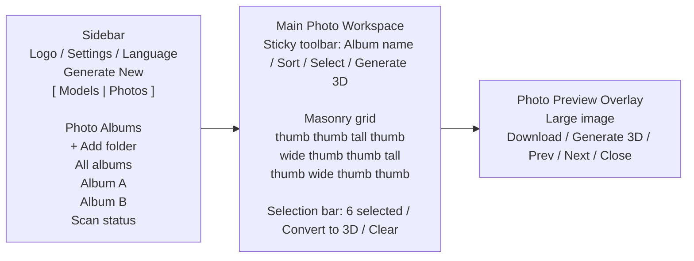
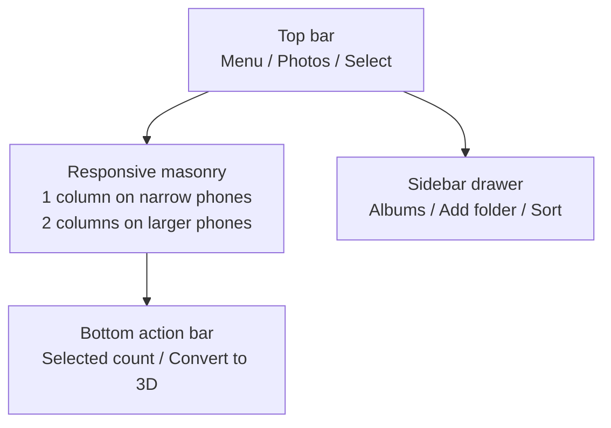

## 背景与现状

当前项目已有几项可复用基础：

- 后端已经有 `ALLOWED_IMAGE_EXTENSIONS`、Pillow 缩略图生成、`/api/original/<id>`、`/api/thumbnail/<id>`、`/api/generate`、`/api/browse-folder` 和任务队列。
- 前端已有模型图库虚拟列表、缩略图加载状态、`ImageViewer` 图片灯箱、任务队列和 3D 查看器。
- 样式语言是 Apple 风格玻璃态 + CSS Modules + CSS Variables，不能引入 Tailwind、CSS-in-JS、Sass 或 axios。
- `browse-folder` 已经考虑 Windows PowerShell、macOS osascript、Linux zenity/kdialog，但只允许 localhost 使用。

新增照片图库应复用这些模式，但不能直接把海量照片塞进现有模型图库数组。照片库需要独立 API、分页、缩略图缓存和瀑布流虚拟化。

## Goals / 目标

- 让用户配置多个本地照片目录，并把每个目录作为一个相册浏览。
- 让桌面端和移动端都有美观、稳定、可快速扫描的照片图库界面。
- 列表只加载缩略图，原图只在预览或下载时请求。
- 支持单张照片一键转换为 3D，支持多选后批量转换为 3D。
- 复用现有任务队列、模型图库刷新和图片预览体验。
- 预览层加载照片原图，避免用列表缩略图放大导致模糊。
- 在 Windows、Linux、macOS 上使用同一套路径安全、目录配置和缓存策略。
- 对大相册保持可用：几千张照片时不一次性渲染所有 DOM，也不一次性生成所有缩略图。

## Non-Goals / 非目标

- 不做用户账号、公网权限、云同步或外网 NAS 鉴权。
- 不做数据库迁移；首版用配置文件和文件缓存。
- 不做图像编辑、标签搜索、人脸识别、EXIF 地图、收藏夹同步。
- 不改 Legacy 单文件前端。
- 不改变现有模型生成算法，也不修改 `ml-sharp/`。

## 推荐信息架构

应用增加一个顶层视图状态：`models` / `photos`。

- `models` 视图保持当前行为：侧栏显示上传、任务队列、模型图库；主区域显示 3D Viewer。
- `photos` 视图：侧栏显示相册列表、添加目录、扫描状态和简单筛选；主区域显示照片瀑布流。

桌面端布局：



移动端布局：



## 视觉设计方向

基于 `ui-ux-pro-max` 检索结果和现有项目风格，推荐采用“Swiss Modernism 2.0 + 项目既有 Glassmorphism”：

- 主区域：清晰网格、宽松间距、高对比文字、避免过度装饰。
- 控件层：使用现有玻璃态面板、半透明边框、`backdrop-filter` 和已有圆角 token。
- 瀑布流卡片：照片本身作为视觉主角，卡片半径保持克制，不叠过多文字。
- 相册封面：首图/最近图大封面 + 目录名称 + 数量，hover/focus 显示操作。
- 多选状态：选中照片使用细边框、角标勾选图标和底部浮动操作条；不要依赖颜色作为唯一提示。
- 移动端：操作按钮常驻可达，不依赖 hover；大按钮高度满足触控。
- 图标：使用项目现有 SVG icon 体系或补充同风格 SVG，不用 emoji 作为 UI 图标。
- 控件：排序、确认、输入与列数调节使用项目自定义玻璃态组件，避免浏览器原生下拉、`prompt`、`confirm`、`alert` 造成割裂。
- 照片卡片标题：默认只显示克制的白色文字与阴影，hover/focus 时再显示半透明玻璃背景，避免小缩略图被标题条遮挡。

## 已实施后的细节校准

根据实现过程中的反馈，最终交互比初版方案做了以下收敛：

- 照片列表项同时返回 `thumb_url`、`preview_url`、`full_url`、`download_url`；其中 `thumb_url` 只用于相册封面和瀑布流，`preview_url` 与 `full_url` 指向 `/api/photo-original/<photo_id>`，预览层始终使用原图。
- `GET /api/photo-original/<photo_id>` 使用 Flask/Werkzeug 的 `download_name` 生成 inline/attachment 响应，避免中文文件名手动写入 `Content-Disposition` 后导致部分浏览器原图空白。
- 排序支持 `mtime_desc`、`mtime_asc`、`ctime_desc`、`ctime_asc`、`name_asc`、`name_desc`、`size_desc`、`size_asc`，UI 展示为“修改时间↓/↑、创建时间↓/↑、名称 A-Z/Z-A、文件大小↓/↑”这类可读标签。
- 展示列数使用图标 + 下拉箭头触发的滑块浮层，滑块包含 1-8 档离散密度和当前档位提示；移动端仍保留双指捏合调整列数。
- 照片图库、模型图库删除确认、添加相册路径输入等流程使用 `SelectMenu`、`ConfirmDialog`、`TextInputDialog` 等通用组件，后续可复用到其他 UI。

## 关键决策

### 决策：照片图库作为独立顶层视图，而不是插入现有模型图库

照片图库入口放在侧栏头部下方的 `模型 / 照片` 分段导航；进入照片视图后，主区域切换为照片瀑布流。

Why：

- 照片数量可能远大于模型作品，交互模式不同。
- 照片图库需要相册、分页、多选和瀑布流，侧栏空间不足。
- 保持现有 3D Viewer 工作流稳定，不让模型图库承担两种数据类型。

Alternatives considered：

- 放在设置里：入口太深，不符合高频浏览。
- 在当前 GalleryList 中混排照片和模型：数据类型、操作和性能策略都会复杂化。
- 新增独立路由页面：当前项目是单页应用，先用内部视图状态更符合现状。

### 决策：每个配置目录作为相册，首版不做深层虚拟相册

`photo_gallery_roots` 中的每个目录显示为一个相册。相册可以支持递归扫描选项，但 UI 上仍以配置目录为相册边界。

Why：

- 用户明确希望“支持多个目录，每个目录可以以相册形式展示”。
- 配置目录作为相册便于跨平台路径管理和权限判断。
- 避免首版把每个子目录都展开成复杂树形图库。

Alternatives considered：

- 每个子目录自动变成相册：更像专业相册，但扫描、导航、性能和封面规则复杂。
- 所有目录合并成一个总图库：浏览方便，但弱化用户指定目录的组织关系。

### 决策：使用文件系统缓存，不引入数据库

缩略图缓存和轻量索引放在工作区内，例如 `photo-gallery-cache/` 或 `.photo-gallery-cache/`，文件名使用稳定 hash，索引记录 root id、相对路径、mtime、size、width、height、thumb version。

Why：

- 项目当前无数据库架构，引入数据库会扩大部署复杂度。
- 文件缓存对 Windows、Linux、macOS 都容易迁移和清理。
- 缩略图可由原图再生，索引损坏可重建。

Alternatives considered：

- SQLite：查询能力更强，但增加迁移、锁和备份考虑；可作为后续增强。
- 纯内存扫描：实现简单，但重启后大图库体验差。

### 决策：后端分页 + 前端瀑布流虚拟化

照片列表 API 分页返回，前端按视口懒加载下一页；瀑布流渲染应虚拟化或至少按页面窗口裁剪，避免一次性渲染成千上万张图片。

Why：

- UI 检索结果明确指出大列表需要虚拟化，移动端必须避免横向溢出。
- 后端不应一次性读取和返回所有照片元数据。
- 列表只显示缩略图，预览才加载原图，能兼容低性能设备。

Alternatives considered：

- CSS columns + 全量 DOM：视觉简单，但大图库性能不可控。
- 一次性返回所有照片，让前端过滤：会放大内存和首屏延迟。

### 决策：照片转换为 3D 走“服务器端照片 ID 入队”

新增转换 API 接收照片 ID 列表，而不是要求浏览器把本地图库图片重新上传。后端验证照片 ID 属于已配置目录后，将源文件复制到 `inputs/` 并加入现有生成队列。

Why：

- 浏览器无法直接读取服务器本地目录文件；后端已经掌握路径。
- 复用现有任务队列、输入目录、缩略图和模型输出命名。
- 可以统一处理文件名冲突、路径安全和任务状态。

Alternatives considered：

- 前端用原图 URL fetch 后再上传：浪费局域网带宽，重复传输大图。
- 直接让 sharp 读取图库原路径：耦合推理任务和图库路径，删除/移动照片时更难追踪。
- 硬链接：性能好但跨盘符、网络盘、macOS/Linux 权限和 Windows 文件系统差异较多，首版用复制更稳。

## API 设计草案

所有新增端点使用 `/api/` 前缀并返回 JSON。

- `GET /api/photo-albums`
  - 返回已配置相册列表、封面缩略图、图片数量、扫描状态。
- `POST /api/photo-albums`
  - localhost only。新增目录配置，body 包含 `path`、`name?`、`recursive?`。
- `DELETE /api/photo-albums/<album_id>`
  - localhost only。移除目录配置，不删除原始照片。
- `POST /api/photo-albums/<album_id>/scan`
  - localhost only。触发重新扫描或刷新索引。
- `GET /api/photo-albums/<album_id>/photos?cursor=&limit=&sort=mtime_desc`
  - 返回分页照片条目，包含 `id`、`name`、`width`、`height`、`thumb_url`、`preview_url`、`full_url`、`download_url`、`created_at`、`updated_at`、`size`。
  - `sort` 支持修改时间、创建时间、名称和文件大小的升降序。
- `GET /api/photo-thumbnail/<photo_id>`
  - 返回缓存缩略图；缺失时按需生成，支持 HTTP 缓存。
- `GET /api/photo-original/<photo_id>?download=1`
  - 返回原图 inline 或 attachment。
- `POST /api/photo-conversions`
  - 接收 `{ photo_ids: string[] }`，验证路径后复制到 `inputs/` 并加入现有任务队列。

安全要求：

- API 不向前端暴露服务器绝对路径。
- `photo_id` 使用 root id + 相对路径 + mtime/size 派生的稳定 token 或服务端索引 ID。
- 所有原图和缩略图服务都必须通过配置 root 验证，不接受任意路径。
- 新增/删除目录这类写配置操作必须保持 localhost only。

## 数据结构草案

`config.json` 新增：

```json
{
  "photo_gallery_roots": [
    {
      "id": "stable-root-id",
      "name": "Family Photos",
      "path": "D:/Photos",
      "recursive": true,
      "enabled": true
    }
  ]
}
```

前端类型草案：

```typescript
export interface PhotoAlbum {
  id: string;
  name: string;
  cover_thumb_url: string | null;
  photo_count: number | null;
  recursive: boolean;
  enabled: boolean;
  scan_status: 'idle' | 'scanning' | 'error';
  updated_at: string | null;
}

export interface PhotoItem {
  id: string;
  album_id: string;
  name: string;
  width: number | null;
  height: number | null;
  thumb_url: string | null;
  full_url: string;
  preview_url: string;
  download_url: string;
  size: number | null;
  created_at: string | null;
  updated_at: string | null;
}
```

## 缩略图与性能策略

- 相册封面和瀑布流列表使用独立缩略图，默认宽度建议 360-480px。
- 预览大图不在列表预加载，只在打开灯箱后通过 `/api/photo-original/<photo_id>` 加载原图。
- 缩略图文件名以 `album_id + relative_path + mtime + size + target_width` hash 生成，原图更新后自动失效。
- 扫描阶段只读取必要元数据；图片尺寸可在缩略图生成时补齐。
- 后端每次请求限制按需生成数量，避免一次打开大相册导致 CPU 飙高。
- 前端瀑布流使用 `loading="lazy"`、`decoding="async"`、稳定 aspect ratio 和虚拟窗口。
- 多选状态只存 photo id 集合，不复制完整照片对象。
- 移动端默认更小 page size 和缩略图宽度；桌面端可更大。

## 跨平台兼容策略

- 路径处理使用 `os.path.abspath`、`os.path.realpath`、`os.path.commonpath`、`os.path.normcase` 和现有 `is_path_inside` 思路，兼容 Windows 跨盘符。
- 所有 API 输出 URL 路径统一使用 `/`，不泄露 `\` 或绝对路径。
- Windows 路径、Linux/macOS POSIX 路径、空格、中文文件名和大小写差异都必须作为测试样例考虑。
- 文件夹选择复用现有 `/api/browse-folder`，但提供手动输入路径兜底；Linux 没有 zenity/kdialog 时仍可配置。
- 不依赖平台特定文件监听器；首版用手动扫描和轻量刷新，后续再评估 watchdog。
- 默认不跟随逃逸出相册 root 的符号链接；如需要支持，必须额外设计安全策略。
- 网络盘/挂载盘读取失败时，相册显示错误状态，不阻塞其他相册。

## 图片预览与 3D 转换交互

预览层在现有 `ImageViewer` 基础上增强：

- 顶部/右上角：下载、生成 3D、关闭。
- 左右：上一张/下一张。
- 底部：文件名、相册名、尺寸、时间。
- 桌面端支持滚轮缩放和拖拽，移动端支持 pinch zoom，沿用现有行为。
- 生成 3D 成功后关闭或保留预览由用户动作决定；任务队列应显示新增任务。

瀑布流多选：

- `选择` 按钮进入多选模式。
- 点击照片角标选择；再次点击取消。
- 底部浮动工具条显示选中数量、`转换为 3D`、`清空`。
- 批量转换提交后创建多个任务，并跳转或提示可在 `模型` 视图查看生成进度。

## 风险 / 缓解

- [大目录扫描卡顿] -> 后端分页和增量索引；扫描状态异步返回；限制每次缩略图生成数量。
- [缩略图生成占用 CPU] -> 使用缓存、按需生成、限制并发，移动端请求更小缩略图。
- [路径遍历或任意文件读取] -> 前端只传 ID；后端从配置 root 反查真实路径并校验 realpath/commonpath。
- [跨平台文件选择不可用] -> 复用现有 browse-folder，并保留手动路径输入。
- [网络盘慢或断开] -> 单相册错误隔离，不影响其他相册和模型查看器。
- [照片与现有模型图库状态互相干扰] -> 顶层视图状态隔离，照片状态单独存储。
- [移动端瀑布流文字/按钮拥挤] -> 移动端减少常驻文本，操作条固定且按钮触控尺寸达标。
- [批量转换误操作] -> 提交前显示选中数量；任务创建后可通过现有任务队列取消未开始任务。

## 回滚策略

- 新增照片图库入口受前端视图状态控制；如出现问题，可隐藏 `照片` 分段入口。
- 后端新增配置字段可缺省，旧 `config.json` 不受影响。
- 新增缩略图缓存可删除后重建，不影响原图和已有模型输出。
- 现有 `/api/gallery`、`/api/generate`、模型查看器和 Legacy 模式保持原行为。

## 验证点

- Windows、Linux、macOS 至少验证手动路径配置与目录扫描行为。
- 验证相册 root 外路径不能通过构造 photo id 或 URL 访问。
- 验证包含空格、中文、大小写混合文件名的图片可预览、下载、生成 3D。
- 验证照片预览请求的是原图 URL 而不是缩略图 URL，下载得到的也是原始文件。
- 验证 1000+ 图片目录下首屏可交互、滚动不明显卡顿、无横向溢出。
- 验证 375、768、1024、1440 宽度下相册列表、瀑布流、多选条和预览层布局稳定。
- 验证移动端列数滑块位置以触发按钮为中心，触控捏合可调节密度且不影响页面滚动。
- 验证中英文切换后所有新增用户可见文案均来自 i18n。
