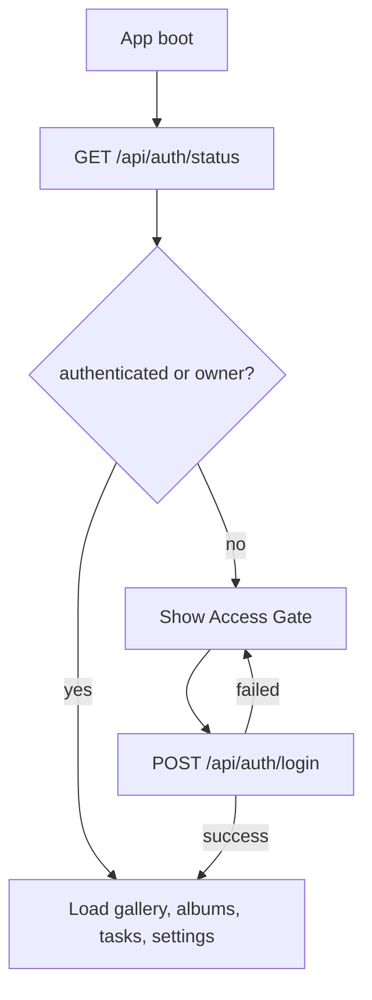

## 背景与现状

Sharp GUI 当前是单文件 Flask 后端加 React SPA。服务启动时绑定 `0.0.0.0:5050`，如果有证书则启用 HTTPS，否则回退 HTTP。后端已经有 `is_local_request()`，并在设置写入、相册目录增删、重启、批量转换等少数操作上限制 localhost。

缺口在于读取面：`/api/gallery`、`/files/*`、模型缩略图、模型原图、模型下载、导出 HTML、照片相册列表、照片缩略图、照片原图和批量下载都可以被局域网直接访问。对一个包含私人照片目录的部署来说，这已经不是“只在本机玩玩”的风险级别。

## Goals / 目标

- 用户可自行选择是否开启局域网门禁；开启后，远程局域网访问必须先通过访问码解锁，才能看到模型、照片、原图、缩略图、下载资源或任务数据。
- localhost owner 默认免登录，避免本机日常使用反复输入访问码。
- 管理操作与浏览操作分开：远程已解锁设备默认只能浏览、预览、下载；设置、目录管理、删除、重启等继续仅限 owner。
- 认证实现保持轻量，无数据库、无账号系统、无新增重依赖。
- 前端体验尽量顺滑：会话长期有效、401 时展示门禁页、解锁后回到原应用。
- 旧配置缺省时可正常启动，并默认提醒本机 owner 配置门禁；选择“稍后”不持久抑制，选择“不再提示”才停止提醒。
- HTTPS 与访问码各自负责不同层面：HTTPS 保护传输，访问码保护访问资格。

## Non-Goals / 非目标

- 不实现多用户、分角色、分相册权限或公网级身份认证。
- 不实现复杂登录审计、设备管理列表或细粒度访问日志后台。
- 不使用 URL token 保护图片资源。
- 不引入数据库、ORM、Flask-Login、JWT 服务端存储或 OAuth provider。
- 不改变导出的离线分享 HTML 的独立打开能力。

## 权限模型

建议采用三层模型，避免过细权限拖累体验：

| 层级 | 判断方式 | 能力 |
|------|----------|------|
| Public | 未授权请求 | 访问 `/`、React assets、根静态图标、认证状态和登录 API |
| Unlocked | 有效会话 Cookie 或 owner | 浏览模型/照片、预览缩略图/原图、下载、导出、读取任务状态 |
| Owner | localhost 请求 | 设置门禁、修改工作区、增删/扫描相册目录、删除模型、重启、批量转换、默认提交生成任务 |

远程生成任务默认不开放。只有在 `access_control.enabled=true` 且用户开启 `allow_remote_generation` 时，Unlocked 设备才可以访问 `/api/generate` 与 `/api/photo-conversions`；删除、设置、重启等仍只允许 Owner。

## 配置结构

`config.json` 增加可缺省的 `access_control`：

```json
{
  "access_control": {
    "enabled": false,
    "password_hash": "pbkdf2:sha256:...",
    "session_secret": "random-url-safe-secret",
    "session_days": 30,
    "allow_localhost_bypass": true,
    "allow_remote_generation": false,
    "session_version": 1,
    "lan_bind_enabled": true
  }
}
```

兼容策略：

- 缺少 `access_control` 时，应用正常启动。
- 缺省状态不强制拦截局域网读取，但本机 owner 启动时应看到门禁建议提示。
- `password_hash` 只存哈希，不保存明文访问码。
- `session_secret` 缺失时由后端生成并持久化；修改访问码或撤销会话时递增 `session_version`。
- 访问 Cookie 使用 `HttpOnly`、`SameSite=Strict`；HTTPS 请求下同时设置 `Secure`。
- 登录失败需要按客户端地址做轻量限速或退避，避免弱访问码被快速暴力猜测。
- Owner 判断只信任真实连接地址和受允许的 Host，不信任 `X-Forwarded-For` 等转发头；如果未来部署在反向代理后面，需要显式配置可信代理。

## 关键决策

### 决策：单访问码 + HttpOnly Cookie，而不是账号体系

使用一个部署级访问码，远程设备登录成功后写入 HttpOnly Cookie。Cookie 内容包含会话版本、过期时间和签名，后端每次请求验证。

Why：

- 个人局域网工具的主要风险是“同网段陌生设备直接看”，单访问码足以覆盖。
- HttpOnly Cookie 可以让图片 ``、模型加载和文件下载自然携带凭证，体验比手动 header token 更好。
- 无数据库，和当前文件配置架构一致。

Alternatives considered：

- Basic Auth：实现最短，但浏览器弹窗体验差，退出和移动端体验不友好。
- Bearer token in localStorage：API 方便，但 ``、直接下载、模型 URL 需要额外签名或 fetch 转 blob，复杂度更高。
- URL token：资源能直接加载，但 token 会进入历史记录、日志和复制链接，隐私风险不适合相册。
- 多账号系统：能力完整，但明显超出个人本地工具需要。

### 决策：localhost owner 免登录，门禁开启后远程必须解锁

`is_local_request()` 为 true 且 `allow_localhost_bypass` 开启时，认为请求来自 Owner。

Why：

- 本机用户是部署者，拥有文件系统访问能力，再要求反复登录意义不大。
- 保留现有“敏感写操作仅限 localhost”的安全边界。
- 配置访问码、撤销会话等管理动作必须有一个无障碍入口。

Alternatives considered：

- localhost 也必须登录：安全边界略一致，但会影响桌面使用体验，且忘记访问码时恢复更麻烦。
- 以访问码授予 owner 权限：远程设备一旦知道访问码就能修改目录或删除资源，不符合隐私工具的最小权限原则。

Security note：

- localhost owner bypass 必须配合 Host 允许列表，避免浏览器 DNS rebinding 把恶意站点请求导向本机服务后获得 owner 权限。
- 不能根据 `X-Forwarded-For`、`Forwarded`、`X-Real-IP` 判断 owner，除非后续明确加入可信代理配置。

### 决策：后端全局拦截优先，前端只负责体验

在 Flask `before_request` 中按路径和 endpoint 分类保护资源。前端门禁页只是 UX，不作为安全边界。

Why：

- 模型、照片、缩略图、下载、`/files/*` 都可以绕过 SPA 直接访问，必须后端兜底。
- 统一拦截避免每个 route 手写遗漏。
- 后续新增 API 时可以通过分类表明确默认权限。

Alternatives considered：

- 只在前端隐藏相册和模型列表：不能阻止直接请求 URL。
- 每个 route 单独检查：更直观，但容易漏掉文件资源和新增端点。

### 决策：远程生成默认关闭

Unlocked 远程设备默认只能浏览、预览、下载；上传生成、照片转 3D、取消任务等高成本行为保持 owner only，除非门禁已开启且用户开启 `allow_remote_generation`。

Why：

- 生成任务消耗 GPU/CPU，局域网设备误触会影响主机。
- 照片转 3D 会把相册原图复制到 `inputs/` 并创建任务，属于比浏览更高风险的写操作。
- 需要时用户可以显式开启，符合“简单但可控”的原则。

Alternatives considered：

- 已解锁即可生成：体验更自由，但风险和资源占用更大。
- 永远禁止远程生成：最保守，但手机/平板挑照片后发起生成是一个合理场景。

### 决策：收紧 CORS

启用 Cookie 会话后，不能继续简单返回 `Access-Control-Allow-Origin: *`。同源访问是主路径；如需 CORS，必须只允许可信 origin 且配置凭证策略。

Why：

- Cookie 会话与通配 CORS 组合容易扩大跨站请求面。
- 当前前端和后端同源部署，生产使用不需要宽泛跨域。
- Vite 开发代理已经能处理本地开发。

Alternatives considered：

- 保持 `*`：最少改动，但和门禁目标冲突。
- 引入 flask-cors：项目规范当前使用手写 `after_request`，不需要额外依赖。

## API 草案

所有新增端点使用 `/api/` 前缀并返回 JSON。

- `GET /api/auth/status`
  - Public。
  - 返回 `{ authenticated, is_owner, access_control_enabled, setup_required, setup_recommended, allow_remote_generation }`。

- `POST /api/auth/login`
  - Public。
  - Body: `{ password: string, remember?: boolean }`。
  - 成功后设置 HttpOnly Cookie，返回认证状态。

- `POST /api/auth/logout`
  - Unlocked。
  - 清除当前 Cookie。

- `POST /api/auth/access-code`
  - Owner only。
  - 设置或修改访问码，必要时启用门禁。

- `POST /api/auth/revoke`
  - Owner only。
  - 递增 `session_version`，让所有旧远程会话失效。

- `POST /api/auth/settings`
  - Owner only。
  - 更新 `enabled`、`session_days`、`allow_remote_generation`、`allow_localhost_bypass`、`lan_bind_enabled` 等非密码配置。

## 受保护资源分类

Public：

- `/`
- `/assets/*`
- React 根静态资源，如 favicon、manifest、logo
- `/api/auth/status`
- `/api/auth/login`

Unlocked：

- `/api/gallery`
- `/api/tasks`
- `/api/download/<item_id>`
- `/api/export/<model_id>`
- `/api/original/<item_id>`
- `/api/thumbnail/<item_id>`
- `/api/photo-albums` GET
- `/api/photo-albums/<album_id>/photos`
- `/api/photo-thumbnail/<photo_id>`
- `/api/photo-original/<photo_id>`
- `/api/photo-downloads`
- `/files/*`

Owner only：

- `/api/settings` POST
- `/api/browse-folder`
- `/api/restart`
- `/api/convert-all`
- `/api/delete/<item_id>`
- `/api/photo-albums` POST
- `/api/photo-albums/<album_id>` DELETE
- `/api/photo-albums/<album_id>/scan` POST
- `/api/task/<task_id>/cancel`
- `/api/generate` 默认
- `/api/photo-conversions` 默认

Conditional：

- `/api/generate` 与 `/api/photo-conversions` 在 `access_control.enabled=true` 且 `allow_remote_generation=true` 时允许 Unlocked。

## 前端体验

启动流程：



UI 原则：

- 门禁页只显示必要内容：应用名、访问码输入、解锁按钮、错误反馈。
- 本机 owner 如果门禁未开启或未设置访问码，进入应用后默认显示安全提醒；“稍后”只关闭本次提示，“不再提示”写入浏览器本地偏好。
- 设置页在门禁关闭时只展示总开关、风险提示和保存动作；开启后再展开访问码、会话天数、远程生成和撤销会话等完整设置。
- 401 代表未解锁，前端切到门禁页；403 代表权限不足，显示“仅本机可执行”的错误反馈。
- 用户可在设置页登出当前远程设备；owner 可撤销所有远程设备。
- 所有新增可见文案同步维护中英文。

## 迁移与兼容

- 旧 `config.json` 不需要手动迁移。
- 没有访问码且门禁关闭时，localhost 可以进入设置并配置，远程设备恢复旧的开放浏览行为。
- 没有访问码但门禁开启时，远程访问应看到需要 owner 设置门禁的提示，不展示私有数据。
- 已有照片相册、模型、缩略图和缓存文件不需要重建。
- Legacy 模式可以继续渲染页面壳，但私有 API 和 `/files/*` 仍必须被后端拦截。

## 风险 / 缓解

- [遗漏私有文件端点] -> 使用默认拒绝思路维护 protected route 分类，并把 `/files/*` 纳入 Unlocked。
- [图片和模型 URL 因 header token 方案难以加载] -> 使用 HttpOnly Cookie，让浏览器资源请求自然携带凭证。
- [远程用户误触高成本生成任务] -> 远程生成默认关闭，设置中显式开启。
- [弱访问码被暴力猜测] -> 登录失败按客户端地址限速或递增延迟，并在 UI 中提示使用足够长度的访问码。
- [DNS rebinding 绕过 localhost owner] -> 校验 Host 只允许 localhost、127.0.0.1、[::1] 和配置/检测到的局域网地址，不接受任意 Host 触发 owner 权限。
- [用户忘记访问码] -> localhost owner 可免登录修改访问码；配置文件仍可由部署者手动重置。
- [CORS 与 Cookie 组合扩大攻击面] -> 同源优先，移除通配凭证能力，开发环境依赖 Vite proxy。
- [会话泄露后长期有效] -> 支持 owner 一键撤销所有会话，并允许配置会话天数。
- [HTTPS 缺失导致访问码明文传输] -> README 和 UI 提醒局域网访问建议启用 HTTPS；门禁不把 HTTPS 视为替代。

## 回滚策略

- `access_control.enabled=false` 可临时关闭门禁，恢复旧的局域网开放读取行为，但 owner-only 管理端点仍必须保持 localhost 限制。
- 删除 `access_control` 配置后，应用按缺省兼容逻辑启动。
- 前端门禁组件可以通过认证状态分支移除，不影响模型和照片主流程。
- 后端保护表可以逐步回退，但必须优先确认没有相册目录暴露需求。

## 验证点

- 门禁开启时，未授权远程请求 `/api/gallery`、`/api/photo-albums`、`/files/*`、缩略图、原图、下载和导出均返回 401。
- localhost 请求无需访问码即可进入应用和设置访问码。
- 远程登录成功后可以浏览模型和照片、预览原图、下载模型和照片。
- 远程已解锁设备默认不能修改设置、增删相册目录、删除模型、重启服务或提交生成任务。
- 开启 `allow_remote_generation` 后，远程已解锁设备可以提交生成任务，但仍不能执行 owner-only 操作。
- 修改访问码或撤销所有会话后，旧远程 Cookie 失效。
- 前端在 401 时显示门禁页，在 403 时显示权限不足反馈。
- `npm run build`、后端语法检查和主要模型/照片流程 smoke test 通过。
